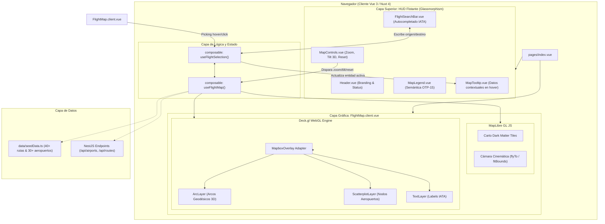

# 🗺️ FlyWise — Plan de Implementación Maestro: Mapa Geográfico Interactivo WebGL

> **Proyecto:** FlyWise — Aeronautical Intelligence System  
> **Materia:** Desarrollo de Software — Año 2026 (2do Cuatrimestre)  
> **Stack:** Nuxt 4 (Vue 3, TypeScript) + Nuxt UI v4 + Tailwind CSS + MapLibre GL JS + Deck.gl (WebGL)

---

## 📑 Tabla de Contenidos

1. [Visión General y Objetivos del Sistema](#1-visión-general-y-objetivos-del-sistema)
2. [Glosario de Conceptos Fundamentales](#2-glosario-de-conceptos-fundamentales)
   - 2.1 [Geodesia y Arcos Ortodrómicos (*Great Circle Arcs*)](#21-geodesia-y-arcos-ortodrómicos-great-circle-arcs)
   - 2.2 [Puntualidad Operativa OTP-15 y Semántica Cromática](#22-puntualidad-operativa-otp-15-y-semántica-cromática)
   - 2.3 [Renderizado Acelerado por GPU: MapLibre GL + Deck.gl](#23-renderizado-acelerado-por-gpu-maplibre-gl--deckgl)
   - 2.4 [Picking e Interactividad en WebGL](#24-picking-e-interactividad-en-webgl)
   - 2.5 [El Puente SSR / Cliente en Nuxt 4 y Prevención de Fugas de Estado](#25-el-puente-ssr--cliente-en-nuxt-4-y-prevención-de-fugas-de-estado)
3. [Arquitectura General del Módulo de Mapas](#3-arquitectura-general-del-módulo-de-mapas)
4. [Plan Paso a Paso Segmentado](#4-plan-paso-a-paso-segmentado)
   - **Paso 1:** [Instalación de Dependencias Seguras (Sin Vulnerabilidades)](#paso-1-instalación-de-dependencias-seguras)
   - **Paso 2:** [Configuración de Nuxt 4, Vite y Nitro (`nuxt.config.ts`)](#paso-2-configuración-de-nuxt-4-vite-y-nitro)
   - **Paso 3:** [Definición de Contratos y Modelos de Datos TypeScript (`types/`)](#paso-3-definición-de-contratos-y-modelos-de-datos-typescript)
   - **Paso 4:** [Dataset Mock de Alta Fidelidad Geoespacial (`seedData.ts`)](#paso-4-dataset-mock-de-alta-fidelidad-geoespacial)
   - **Paso 5:** [Capa de Estado Global Compartido (`useFlightSelection.ts`)](#paso-5-capa-de-estado-global-compartido)
   - **Paso 6:** [Controlador del Motor WebGL y Cámara (`useFlightMap.ts`)](#paso-6-controlador-del-motor-webgl-y-cámara)
   - **Paso 7:** [Componentes Atómicos HUD (`OtpBadge.vue`, `MapLegend.vue`, `MapControls.vue`)](#paso-7-componentes-atómicos-hud)
   - **Paso 8:** [Tooltip Refractivo de Información de Vuelo (`MapTooltip.vue`)](#paso-8-tooltip-refractivo-de-información-de-vuelo)
   - **Paso 9:** [Canvas WebGL a Pantalla Completa (`FlightMap.client.vue`)](#paso-9-canvas-webgl-a-pantalla-completa)
   - **Paso 10:** [Buscador Flotante con Autocompletado y Filtros (`FlightSearchBar.vue`)](#paso-10-buscador-flotante-con-autocompletado-y-filtros)
   - **Paso 11:** [Integración de la Experiencia Completa en la Página Principal (`pages/index.vue`)](#paso-11-integración-de-la-experiencia-completa-en-la-página-principal)
5. [Plan de Pruebas, Verificación y Perfilado a 60 FPS](#5-plan-de-pruebas-verificación-y-perfilado-a-60-fps)

---

## 1. Visión General y Objetivos del Sistema

El objetivo de este módulo es dotar a **FlyWise** de un centro de control visual (*Mission Control*) geoespacial capaz de renderizar miles de rutas aéreas comerciales y aeropuertos globales en tiempo real con una tasa de refresco fluida de **60 cuadros por segundo (FPS)**.

A través de esta interfaz, el usuario puede explorar visualmente la red global de conexiones, filtrar rutas por origen/destino y auditar de inmediato la confiabilidad histórica (**OTP-15**) de las aerolíneas mediante una codificación cromática intuitiva y arcos tridimensionales que se elevan sobre el globo terráqueo.

---

## 2. Glosario de Conceptos Fundamentales

Para comprender a fondo cada decisión técnica, repasamos los conceptos aeroespaciales y gráficos involucrados:

### 2.1 Geodesia y Arcos Ortodrómicos (*Great Circle Arcs*)
* **¿Qué es la ortodrómica?** La Tierra es un esferoide oblato. La distancia más corta entre dos puntos en la superficie terrestre no es una línea recta cartesiana en un mapa 2D, sino el arco de un **círculo máximo (*Great Circle*)**.
* **En el Mapa:** Deck.gl incluye la propiedad `greatCircle: true` en su capa `ArcLayer`. Esto traza la trayectoria geodésica curvada real (por ejemplo, la ruta Buenos Aires `EZE` $\rightarrow$ Madrid `MAD` vuela curvándose sobre el Océano Atlántico y el noreste de Brasil, en lugar de una recta Euclídea plana).
* **Elevación 3D:** El arco geodésico proyecta una parábola en el eje Z (altitud) cuya altura máxima es proporcional a la distancia ortodrómica entre los dos aeropuertos, lo que crea un efecto visual inmersivo al rotar la cámara en 3D (*pitch/tilt*).

### 2.2 Puntualidad Operativa OTP-15 y Semántica Cromática
* **Definición de OTP-15 (*On-Time Performance*):** Métrica estándar de la industria aeronáutica (IATA / FAA / ANAC) que considera un vuelo como **puntual** si arriba a su puerta de desembarque con un retraso menor o igual a **15 minutos** respecto a su itinerario programado.
* **Mapeo Cromático Fijo (Design System):**
  - 🟢 **Verde Esmeralda (`#10b981` / `rgba(16, 185, 129, 0.85)`):** $\text{OTP-15} \ge 85\%$. Excelente confiabilidad histórica.
  - 🟡 **Ámbar Dorado (`#f59e0b` / `rgba(245, 158, 11, 0.85)`):** $60\% \le \text{OTP-15} < 85\%$. Puntualidad moderada, probabilidad media de demoras leves (15-45 min).
  - 🔴 **Carmesí Coral (`#ef4444` / `rgba(239, 68, 68, 0.85)`):** $\text{OTP-15} < 60\%$. Riesgo crítico de demoras graves o cancelaciones recurrentes.

### 2.3 Renderizado Acelerado por GPU: MapLibre GL + Deck.gl
* **MapLibre GL JS:** Maneja el mapa base (teselas de Carto Dark Matter), la proyección cartográfica de Web Mercator, la cámara (coordenadas centrales, nivel de zoom, rotación de rumbo `bearing` e inclinación `pitch`) y los eventos del puntero del usuario.
* **Deck.gl (`@deck.gl/core`, `@deck.gl/layers`):** Es una suite de renderizado WebGL acelerada por hardware orientada a analítica geoespacial masiva. En lugar de crear miles de elementos en el DOM (lo que congelaría el navegador), Deck.gl compila los datos geográficos en *buffers* de memoria directamente en la GPU (VRAM) y los dibuja en una sola pasada usando shaders GLSL a 60 FPS.
* **Sincronización vía `MapboxOverlay` (`@deck.gl/mapbox`):** Es el adaptador oficial que implementa la interfaz `IControl` de MapLibre GL. Se conecta al ciclo de renderizado de MapLibre y sincroniza en cada cuadro la matriz de proyección (cámara) entre MapLibre y los shaders de Deck.gl, eliminando cualquier desfase (*lag* o *jitter*) entre el mapa base y los arcos de vuelo.

### 2.4 Picking e Interactividad en WebGL
* **¿Cómo detecta la GPU sobre qué vuelo está el mouse?**  
  En HTML tradicional usamos eventos DOM (`mouseenter`, `click`). En WebGL no hay elementos DOM para cada arco. Deck.gl implementa una técnica llamada **Color-based Picking**: en un *framebuffer* oculto fuera de pantalla (*offscreen*), Deck.gl dibuja cada arco y nodo con un color RGB único de 32 bits (su ID). Al mover el cursor, lee el píxel debajo del mouse y resuelve instantáneamente qué objeto (`FlightRoute` o `Airport`) fue tocado en $O(1)$, disparando el evento `onHover` con los datos exactos del vuelo y sus coordenadas de pantalla `(x, y)` para posicionar el tooltip.

### 2.5 El Puente SSR / Cliente en Nuxt 4 y Prevención de Fugas de Estado
* **El Problema del SSR:** Nuxt ejecuta el código en Node.js en el servidor antes de enviarlo al navegador. Objetos como `window`, `document`, `HTMLCanvasElement` o `WebGL2RenderingContext` no existen en Node.js.
* **Componentes `.client.vue`:** Indican a Nuxt que el componente jamás debe ejecutarse en el servidor, montándose únicamente cuando el DOM del navegador está listo.
* **`useState` vs `ref` global:** En Node.js, un `ref` declarado fuera de una función se compartiría entre todas las peticiones de diferentes usuarios (*Cross-Request State Pollution*). `useState(key, init)` en Nuxt crea un estado reactivo aislado por usuario que se serializa de forma segura del servidor al cliente.

---

## 3. Arquitectura General del Módulo de Mapas



---

## 4. Plan Paso a Paso Segmentado

A continuación se detalla la secuencia de ejecución ordenada por dependencias lógicas:

---

### Paso 1: Instalación de Dependencias Seguras
* **Objetivo:** Instalar exclusivamente los paquetes oficiales de Deck.gl v9 compatibles con MapLibre GL JS, eliminando librerías innecesarias o vulnerables.
* **Acción:**
  ```bash
  cd frontend
  npm install @deck.gl/core @deck.gl/layers @deck.gl/mapbox
  npm uninstall @types/maplibre-gl
  ```
* **Concepto Clave:**
  - `@deck.gl/layers` incluye `ArcLayer`, `ScatterplotLayer` y `TextLayer` sin arrastrar vulnerabilidades de parsers de imágenes.
  - `maplibre-gl` v6 ya provee tipos TypeScript nativos; eliminamos `@types/maplibre-gl` (obsoleto de 2021).

---

### Paso 2: Configuración de Nuxt 4, Vite y Nitro
* **Objetivo:** Inyectar el CSS del mapa y habilitar la transpilación WebGL en [`frontend/nuxt.config.ts`](file:///home/delforr/Documents/Universidad/3er%20a%C3%B1o/Desarrollo%20de%20Software/Proyecto/frontend/nuxt.config.ts).
* **Acción:**
  ```typescript
  // frontend/nuxt.config.ts
  export default defineNuxtConfig({
    compatibilityDate: '2025-07-15',
    devtools: { enabled: true },
    modules: ['@nuxt/ui'],

    css: [
      'maplibre-gl/dist/maplibre-gl.css', // 1. Estilos base del canvas y controles
      '~/app.css'                         // 2. Tokens del Design System y Tailwind v4
    ],

    build: {
      transpile: [
        '@deck.gl/core',
        '@deck.gl/layers',
        '@deck.gl/mapbox',
        'maplibre-gl',
      ],
    },

    vite: {
      optimizeDeps: {
        include: [
          'maplibre-gl',
          '@deck.gl/core',
          '@deck.gl/layers',
          '@deck.gl/mapbox',
        ],
      },
    },
  })
  ```
* **Concepto Clave:**
  - `maplibre-gl.css` previene que el `<canvas>` colapse a $0\times 0$ px.
  - `build.transpile` previene errores de `ReferenceError: window is not defined` durante el empaquetado SSR de Nitro.
  - `vite.optimizeDeps` pre-empaqueta dependencias con `esbuild` para HMR instantáneo en desarrollo.

---

### Paso 3: Definición de Contratos y Modelos de Datos TypeScript
* **Objetivo:** Crear tipado estricto para aeropuertos, rutas analíticas, puntualidad de aerolíneas y estados de cámara.
* **Archivos a crear:**

#### 3.1 [`frontend/app/types/airport.ts`](file:///home/delforr/Documents/Universidad/3er%20a%C3%B1o/Desarrollo%20de%20Software/Proyecto/frontend/app/types/airport.ts)
```typescript
export interface Airport {
  id: string                   // ej. "EZE"
  iata: string                 // Código IATA de 3 letras (ej. "EZE")
  icao?: string                // Código ICAO de 4 letras (ej. "SAEZ")
  name: string                 // ej. "Ministro Pistarini Int. Airport"
  city: string                 // ej. "Buenos Aires"
  country: string              // ej. "Argentina"
  coordinates: [number, number]// [Longitud, Latitud] en formato EPSG:4326
  elevation?: number           // Elevación en pies sobre el nivel del mar
  type: 'large_airport' | 'medium_airport' | 'small_airport'
  connectionsCount?: number    // Total de rutas activas conectadas
}
```

#### 3.2 [`frontend/app/types/route.ts`](file:///home/delforr/Documents/Universidad/3er%20a%C3%B1o/Desarrollo%20de%20Software/Proyecto/frontend/app/types/route.ts)
```typescript
export interface RouteAirlinePerformance {
  airlineCode: string          // ej. "IB", "AR"
  airlineName: string          // ej. "Iberia", "Aerolíneas Argentinas"
  otp15: number                // Porcentaje 0 - 100 (ej. 92.4)
  avgDelayMinutes: number      // Demora media en minutos
  cancellationRate: number     // Tasa de cancelaciones (ej. 0.5%)
  sampleFlightsCount: number   // Muestra de vuelos analizados
}

export interface FlightRoute {
  id: string                   // Identificador compuesto (ej. "EZE-MAD")
  originIata: string
  originName: string
  originCity: string
  originCoordinates: [number, number] // [lon, lat]
  
  destinationIata: string
  destinationName: string
  destinationCity: string
  destinationCoordinates: [number, number] // [lon, lat]
  
  distanceKm: number           // Distancia geodésica ortodrómica en km
  averageOtp15: number         // OTP-15 ponderado del tramo
  airlines: RouteAirlinePerformance[]
  primaryAirline: string       // Aerolínea de mayor volumen en la ruta
}
```

#### 3.3 [`frontend/app/types/map.ts`](file:///home/delforr/Documents/Universidad/3er%20a%C3%B1o/Desarrollo%20de%20Software/Proyecto/frontend/app/types/map.ts)
```typescript
import type { Airport } from './airport'
import type { FlightRoute } from './route'

export interface MapViewState {
  longitude: number
  latitude: number
  zoom: number
  pitch: number               // Inclinación 3D (0° a 60°)
  bearing: number             // Rotación de brújula (-180° a 180°)
}

export type MapPickingInfo = {
  type: 'route' | 'airport'
  data: FlightRoute | Airport
  x: number                   // Coordenada X del puntero en píxeles de pantalla
  y: number                   // Coordenada Y del puntero en píxeles de pantalla
} | null
```

---

### Paso 4: Dataset Mock de Alta Fidelidad Geoespacial
* **Objetivo:** Crear [`frontend/app/data/seedData.ts`](file:///home/delforr/Documents/Universidad/3er%20a%C3%B1o/Desarrollo%20de%20Software/Proyecto/frontend/app/data/seedData.ts) con más de 30 aeropuertos clave (América, Europa, Asia) y más de 40 rutas intercontinentales con métricas OTP-15 calculadas.
* **Concepto Clave:** Contiene datos geométricamente exactos (longitudes y latitudes reales) que cubren las 3 categorías OTP-15 (verde $\ge 85\%$, amarillo $60-85\%$, rojo $< 60\%$) para validar inmediatamente el renderizado y los tooltips.

---

### Paso 5: Capa de Estado Global Compartido (`useFlightSelection.ts`)
* **Objetivo:** Implementar [`frontend/app/composables/useFlightSelection.ts`](file:///home/delforr/Documents/Universidad/3er%20a%C3%B1o/Desarrollo%20de%20Software/Proyecto/frontend/app/composables/useFlightSelection.ts) para orquestar la selección entre la barra de búsqueda, el mapa y los tooltips.
* **Estructura Interna:**
  - `selectedOrigin`: `useState<string | null>('flight_origin', () => null)`
  - `selectedDestination`: `useState<string | null>('flight_destination', () => null)`
  - `hoveredEntity`: `useState<MapPickingInfo>('flight_hovered', () => null)`
  - `activeRouteId`: `computed(() => (origin && dest ? `${origin}-${dest}` : null))`
  - Acciones: `setOrigin()`, `setDestination()`, `swapRoute()`, `clearSelection()`, `setHovered()`.

---

### Paso 6: Controlador del Motor WebGL y Cámara (`useFlightMap.ts`)
* **Objetivo:** Implementar [`frontend/app/composables/useFlightMap.ts`](file:///home/delforr/Documents/Universidad/3er%20a%C3%B1o/Desarrollo%20de%20Software/Proyecto/frontend/app/composables/useFlightMap.ts) para controlar el ciclo de vida de MapLibre GL y las capas Deck.gl.
* **Responsabilidades:**
  1. **Inicialización:** Instancia `maplibregl.Map` apuntando al contenedor DOM con el estilo Carto Dark Matter (`https://basemaps.cartocdn.com/gl/dark-matter-gl-style/style.json`).
  2. **Overlay Deck.gl:** Instancia `MapboxOverlay` y lo acopla al mapa mediante `map.addControl(overlay)`.
  3. **Generación de Capas:**
     - `createArcLayer(routes, activeRouteId)`: Aplica función de color `[16, 185, 129, 210]` para OTP alto, `[245, 158, 11, 210]` para medio, `[239, 68, 68, 210]` para crítico, y resalta con ancho 4.5px el tramo seleccionado.
     - `createScatterplotLayer(airports, activeOrigin, activeDest)`: Dibuja los nodos de aeropuertos con radio dinámico y borde contrastado.
     - `createTextLayer(airports)`: Renderiza códigos IATA en fuente `JetBrains Mono` al hacer zoom.
  4. **Cinemática de Cámara:**
     - `flyToAirport(coords, zoom = 6)`: Animación de vuelo suave al aeropuerto seleccionado.
     - `fitRoute(originCoords, destCoords)`: Calcula el bounding box y ajusta la cámara para encuadrar la ruta completa con padding.
     - `toggle3D()`: Alterna la inclinación entre 0° (2D cenital) y 45° (3D perspectiva).
     - `resetNorth()`: Restablece el rumbo `bearing: 0`.
  5. **Limpieza:** En `onUnmounted`, destruye el overlay y remueve la instancia de MapLibre para prevenir fugas de memoria GPU.

---

### Paso 7: Componentes Atómicos HUD
* **Objetivo:** Crear los componentes visuales reutilizables con estética Cockpit Glassmorphism (`DESIGN.md` y `app.css`).

#### 7.1 [`frontend/app/components/common/OtpBadge.vue`](file:///home/delforr/Documents/Universidad/3er%20a%C3%B1o/Desarrollo%20de%20Software/Proyecto/frontend/app/components/common/OtpBadge.vue)
- Muestra el porcentaje con tipografía `font-mono` (`JetBrains Mono`).
- Aplica dinámicamente `.badge-otp-good` ($\ge 85\%$), `.badge-otp-warning` ($60-85\%$) o `.badge-otp-critical` ($< 60\%$) con punto indicador de estado.

#### 7.2 [`frontend/app/components/map/MapLegend.vue`](file:///home/delforr/Documents/Universidad/3er%20a%C3%B1o/Desarrollo%20de%20Software/Proyecto/frontend/app/components/map/MapLegend.vue)
- Panel flotante translúcido (`hud-panel`) en la esquina inferior izquierda con la leyenda oficial:
  - 🟢 **$\ge 85\%$** Confiabilidad Alta
  - 🟡 **$60 - 85\%$** Confiabilidad Moderada
  - 🔴 **$< 60\%$** Demora Crítica

#### 7.3 [`frontend/app/components/map/MapControls.vue`](file:///home/delforr/Documents/Universidad/3er%20a%C3%B1o/Desarrollo%20de%20Software/Proyecto/frontend/app/components/map/MapControls.vue)
- Grupo de botones flotantes en la esquina inferior/superior derecha:
  - Botones Zoom `+` y `-`.
  - Botón **3D / 2D** (Pitch toggle con badge de ángulo actual).
  - Botón **Brújula / Reset Norte**.

---

### Paso 8: Tooltip Refractivo de Información de Vuelo (`MapTooltip.vue`)
* **Objetivo:** Crear [`frontend/app/components/map/MapTooltip.vue`](file:///home/delforr/Documents/Universidad/3er%20a%C3%B1o/Desarrollo%20de%20Software/Proyecto/frontend/app/components/map/MapTooltip.vue).
* **Comportamiento:**
  - Sigue la posición `(x, y)` del puntero en pantalla con posicionamiento absoluto `transform: translate3d(x, y, 0)` y transición suave.
  - Si el usuario hace hover en una **Ruta**: Muestra `EZE ➔ MAD`, distancia en km, aerolínea operadora principal, porcentaje OTP-15 y badge semántico.
  - Si hace hover en un **Aeropuerto**: Muestra código IATA, nombre oficial, ciudad, país y número de conexiones directas.

---

### Paso 9: Canvas WebGL a Pantalla Completa (`FlightMap.client.vue`)
* **Objetivo:** Crear [`frontend/app/components/map/FlightMap.client.vue`](file:///home/delforr/Documents/Universidad/3er%20a%C3%B1o/Desarrollo%20de%20Software/Proyecto/frontend/app/components/map/FlightMap.client.vue).
* **Detalles Técnicos:**
  - Contenedor `<div ref="mapContainer" class="w-full h-full relative" />`.
  - Sufijo `.client.vue` para garantizar ejecución 100% del lado del cliente.
  - Integración de `ResizeObserver` para invocar `map.resize()` automáticamente cuando cambie el tamaño de la ventana o se abran paneles laterales.
  - Conexión con los eventos de Deck.gl (`onHover`, `onClick`) para actualizar el composable de selección.

---

### Paso 10: Buscador Flotante con Autocompletado y Filtros (`FlightSearchBar.vue`)
* **Objetivo:** Crear [`frontend/app/components/search/FlightSearchBar.vue`](file:///home/delforr/Documents/Universidad/3er%20a%C3%B1o/Desarrollo%20de%20Software/Proyecto/frontend/app/components/search/FlightSearchBar.vue).
* **Características:**
  - Panel flotante `hud-panel` posicionado en la parte superior o lateral.
  - Dos inputs interactivos para **Origen** y **Destino** con filtrado predictivo por IATA, Ciudad o Nombre de Aeropuerto.
  - Botón de intercambio de ruta `⇄` (*Swap* con microinteracción táctil).
  - Botón "Centrar Ruta" que activa el vuelo cinemático de cámara hacia el tramo seleccionado.

---

### Paso 11: Integración en la Página Principal (`pages/index.vue`)
* **Objetivo:** Ensamblar todos los módulos en [`frontend/app/pages/index.vue`](file:///home/delforr/Documents/Universidad/3er%20a%C3%B1o/Desarrollo%20de%20Software/Proyecto/frontend/app/pages/index.vue).
* **Estructura del Layout:**
  - Fondo absoluto a pantalla completa: `<FlightMap />` envuelto en `<ClientOnly>`.
  - Capa superior fija (*z-index 40-50*): `<Header />` en la parte superior.
  - Buscador flotante `<FlightSearchBar />` sobre el mapa.
  - Controles HUD `<MapControls />` y Leyenda `<MapLegend />` en las esquinas inferiores.
  - Tooltip reactivo `<MapTooltip />`.

---

## 5. Plan de Pruebas, Verificación y Perfilado a 60 FPS

### 5.1 Verificación Automatizada de Tipos y Build SSR
```bash
# 1. Verificación estricta de tipos de TypeScript en Nuxt
cd frontend && npx nuxi typecheck

# 2. Compilación completa de producción (Verifica que SSR no falle con WebGL)
cd frontend && npm run build
```

### 5.2 Pruebas de Rendimiento Gráfico (60 FPS)
1. Abrir **Chrome DevTools $\rightarrow$ Rendering $\rightarrow$ Frame Rendering Stats**.
2. Realizar paneos rápidos, rotación de 360° y zoom continuo sobre la red global de rutas.
3. **Criterio de Éxito:** La tasa de refresco debe mantenerse estable a 60 FPS sin caída de cuadros (*dropped frames*).

### 5.3 Pruebas de Interacción y Picking
1. **Hover en Arcos:** Pasar el cursor sobre el arco transatlántico `EZE-MAD` $\rightarrow$ el arco debe engrosarse a 3px, cambiar su color a `Aero Cyan` y mostrar el tooltip con métricas de Iberia / Aerolíneas Argentinas.
2. **Click y Cinemática:** Seleccionar `EZE` como origen y `MAD` como destino $\rightarrow$ la cámara debe ejecutar una animación suave (`fitBounds` de 1.5s) inclinándose a 40° para encuadrar la ruta.
3. **Controles 3D:** Hacer clic en el botón `3D` $\rightarrow$ la cámara debe alternar fluidamente entre vista cenital (2D) y perspectiva con relieve de arcos.
