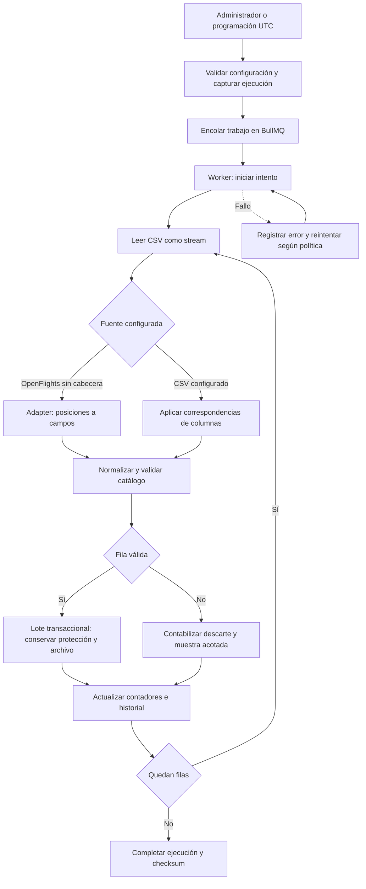
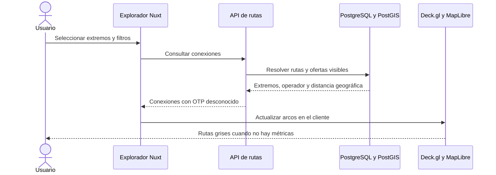

# Flujos principales de FlyWise

Diagramas del sistema implementado. El spec define las ampliaciones por ticket.

## Ingesta de catálogos

```mermaid
flowchart TD
    A[Administrador o programación UTC] --> B[Validar configuración y capturar ejecución]
    B --> C[Encolar trabajo en BullMQ]
    C --> D[Worker: iniciar intento]
    D --> E[Leer CSV como stream]
    E --> F{Fuente configurada}
    F -->|OpenFlights sin cabecera| G[Adapter: posiciones a campos]
    F -->|CSV configurado| H[Aplicar correspondencias de columnas]
    G --> I[Normalizar y validar catálogo]
    H --> I
    I --> J{Fila válida}
    J -->|Sí| K[Lote transaccional: conservar protección y archivo]
    J -->|No| L[Contabilizar descarte y muestra acotada]
    K --> M[Actualizar contadores e historial]
    L --> M
    M --> N{Quedan filas}
    N -->|Sí| E
    N -->|No| O[Completar ejecución y checksum]
    D -. Fallo .-> P[Registrar error y reintentar según política]
    P --> D
```

## Consulta de rutas y mapa

```mermaid
sequenceDiagram
    actor Usuario
    participant UI as Explorador Nuxt
    participant API as API de rutas
    participant DB as PostgreSQL y PostGIS
    participant Mapa as Deck.gl y MapLibre
    Usuario->>UI: Seleccionar extremos y filtros
    UI->>API: Consultar conexiones
    API->>DB: Resolver rutas y ofertas visibles
    DB-->>API: Extremos, operador y distancia geográfica
    API-->>UI: Conexiones con OTP desconocido
    UI->>Mapa: Actualizar arcos en el cliente
    Mapa-->>Usuario: Rutas grises cuando no hay métricas
```
